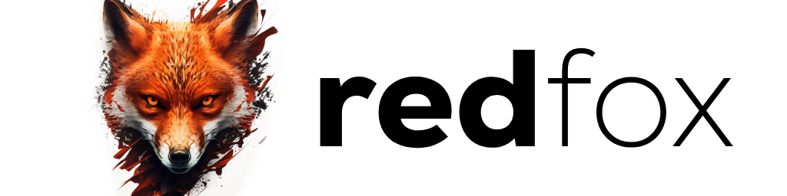

RedFox is my set of utilities and libraries for various languages (currently primarily C#/.NET) that I use across my projects. It covers compression, IO (Virtual File System, Stream Extensions, Process Interop), 3D (Skeletal animation, scene graph), Cryptography (Hashing and Encryption), Imaging (pure C# image decoders/encoders), and more.

RedFox is ultimately a personal project that I also use for learning purposes and experimenting, you may find a lot of code here with conflicting design choices, etc. where I am testing the waters with certain patterns, features, and alike.

# AI Disclosure

Part of my experimenting and learning is utilizing AI to generate code, some of the code in this library is ultimately AI generated, I think AI is a powerful tool when used correctly and personally I have an interest in improvements in local LLMs that don't rely on giant data centers, if you don't like AI/AI code, please don't use this library.

# Issues/PRs

I will take issues/PRs, please be as detailed as possible and provide any samples (if required), along with your use case.

# License

The code implemented in this library is provided under the MIT license, please do keep in mind I use third-party libraries that may contain different licenses. It your responsibility to check this.